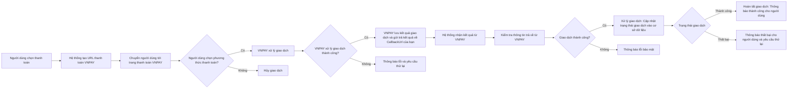

# © 2024 Phan Xuan Quang / VNPAY.NET
 


VNPAY là một dịch vụ thanh toán trực tuyến phổ biến tại Việt Nam, hỗ trợ nhiều phương thức thanh toán như thẻ tín dụng, thẻ ATM, QR Code, và ví điện tử. Việc tích hợp VNPAY vào dự án C# .NET sẽ giúp bạn cung cấp cho người dùng một phương thức thanh toán thuận tiện và bảo mật.

Mục tiêu của thư viện này là đơn giản hóa quá trình thiết lập và xử lý giao dịch cho nhà phát triển, đồng thời cải thiện hiệu suất so với code mẫu từ VNPAY.

## :factory: Cơ chế xử lý



1. Người dùng chọn thanh toán cho sản phẩm/dịch vụ trên website của bạn.
   
2. Hệ thống của bạn tạo URL chứa các tham số giao dịch.
   
3. Người dùng được chuyển đến trang thanh toán của VNPAY.
   
4. Người dùng chọn phương thức thanh toán (QR, thẻ tín dụng, thẻ ATM,...).
   
5. VNPAY nhận yêu cầu và xử lý giao dịch. Nếu thành công, chuyển đến bước tiếp theo; nếu không, người dùng sẽ nhận thông báo lỗi và giao dịch bị hủy.
    
6. Nếu giao dịch thành công, VNPAY trả kết quả về `CallbackUrl` của bạn.
    
7. Hệ thống của bạn nhận kết quả trả về từ VNPAY qua URL `CallbackUrl` và tiến hành kiểm tra.
    
8. Hệ thống của bạn kiểm tra trạng thái giao dịch. Nếu thành công, hệ thống cập nhật trạng thái và thông báo thành công cho người dùng.
    - Nếu giao dịch thành công (mã trạng thái `00`), hệ thống cập nhật trạng thái và thông báo thành công cho người dùng.
    - Nếu giao dịch thất bại (mã trạng thái khác `00`), hệ thống thông báo lỗi và yêu cầu người dùng thử lại.

## :electric_plug: Cài đặt thư viện `VNPAY.NET`
- Cách 1: Tìm và cài đặt thông qua **NuGet Package Manager** nếu bạn sử dụng Visual Studio.


- Cách 2: Cài đặt thông qua môi trường dòng lệnh. Chi tiết tại [**ĐÂY**](https://www.nuget.org/packages/VNPAY.NET).

## :black_nib: Đăng ký tài khoản và lấy thông tin từ VNPAY
> [!NOTE]
> Đăng ký để lấy thông tin tích hợp tại [**ĐÂY**](https://sandbox.vnpayment.vn/devreg/). Hệ thống sẽ gửi thông tin kết nối về email được đăng ký.

| Thông tin    | Mô tả                                                                                                                                                                           |
|--------------|--------------------------------------------------------------------------------------------------------------------------------------------------------------------------------|
| `vnp_TmnCode`      | Mã định danh kết nối được khai báo tại hệ thống của VNPAY. Mã định danh tương ứng với tên miền website, ứng dụng, dịch vụ của merchant kết nối vào VNPAY. Mỗi đơn vị có thể có một hoặc nhiều mã TmnCode kết nối. |
| `vnp_HashSecret`   | Chuỗi bí mật sử dụng để kiểm tra toàn vẹn dữ liệu khi hai hệ thống trao đổi thông tin (checksum).                                                                               |
| `BaseUrl`      | URL thanh toán. Đối với môi trường Sandbox (thử nghiệm), URL là `https://sandbox.vnpayment.vn/paymentv2/vpcpay.html`.                                                                      |
| `vnp_ReturnUrl`  | URL truy vấn kết quả giao dịch. URL này được tự động chuyển đến sau khi giao dịch được thực hiện.                                                                              |

## :dart: Hướng dẫn sử dụng

### 1. Thêm thông tin cấu hình VNPAY vào dự án
#### a. Đối với ASP.NET Core (từ .NET 6 về sau) sử dụng `appsettings.json`
Thêm những thông tin cấu hình lấy từ VNPAY vào `appsettings.json` như ví dụ sau:
```cs
{
  "Vnpay": {
    "TmnCode": "A1B2C3D4", // Ví dụ
    "HashSecret": "A4D3C4C6D1Đ3D1D4QCS16PAFHI2GJ42D", // Ví dụ
    "BaseUrl": "https://sandbox.vnpayment.vn/paymentv2/vpcpay.html", // Ví dụ URL của môi trường Sandbox
    "ReturnUrl": "https://localhost:1234/api/Vnpay/Callback" // Ví dụ
  }
}
```

#### b. **Với .NET Framework** (dùng `web.config`)
Thêm những thông tin cấu hình lấy từ VNPAY vào `web.config` như ví dụ sau:
```xml
<appSettings>
  <add key="TmnCode" value="A1B2C3D4" />
  <add key="HashSecret" value="A4D3C4C6D1Đ3D1D4QCS16PAFHI2GJ42D" />
  <add key="BaseUrl" value="https://sandbox.vnpayment.vn/paymentv2/vpcpay.html" />
  <add key="ReturnUrl" value="https://localhost:1234/api/Vnpay/Callback" />
</appSettings>
```

### 1. Khởi tạo

- Cách 1 - Thông qua Dependency Injection:
```csharp
using VNPAY.NET;

public class VnpayPayment
{
    private string _tmnCode;
    private string _hashSecret;
    private string _baseUrl;
    private string _callbackUrl;

    private readonly IVnpay _vnpay;

    public VnpayPayment(IVnpay vnpay)
    {
        // Khởi tạo giá trị cho _tmnCode, _hashSecret, _baseUrl, _callbackUrl tại đây.
        _vnpay = vnpay;
        _vnpay.Initialize(_tmnCode, _hashSecret, _baseUrl, _callbackUrl);
    }
}
```

- Cách 2 - Khởi tạo đối tượng:
```csharp
using VNPAY.NET;

public class VnpayPayment
{
    private string _tmnCode;
    private string _hashSecret;
    private string _baseUrl;
    private string _callbackUrl;

    private readonly IVnpay _vnpay;

    public VnpayPayment()
    {
        // Khởi tạo giá trị cho _tmnCode, _hashSecret, _baseUrl, _callbackUrl tại đây.
        _vnpay = new Vnpay();
        _vnpay.Initialize(_tmnCode, _hashSecret, _baseUrl, _callbackUrl);
    }
}
```
## ⚙️ Xây dựng các Controller xử lý thanh toán

### 1. Tạo URL thanh toán
```csharp
[HttpGet("CreatePaymentUrl")]
public ActionResult<string> CreatePaymentUrl(double moneyToPay, string description)
{
    if (moneyToPay <= 0)
    {
        return BadRequest("Số tiền phải lớn hơn 0.");
    }

    var ipAddress = NetworkHelper.GetIpAddress(HttpContext); // Lấy địa chỉ IP của thiết bị thực hiện giao dịch

    var request = new PaymentRequest
    {
        PaymentId = DateTime.Now.Ticks, 
        Money = moneyToPay,
        Description = description,
        IpAddress = ipAddress
    };

    var paymentUrl = _vnpay.GetPaymentUrl(request); 

    return Created(paymentUrl, paymentUrl);
}
```

Bạn có thể tạo `paymentRequest` với nhiều thông tin hơn như ví dụ sau:
```cs
var paymentRequest = new PaymentRequest
{
    PaymentId = 123456789, 
    Description = "Thanh toan hoa don dich vu", 
    Money = 5000000, // Số tiền thanh toán
    BankCode = BankCode.ANY, // Phương thức thanh toán (ở đây là bất kỳ phương thức nào)
    IpAddress = "192.168.1.1", // Địa chỉ IP của người dùng
    CreatedDate = DateTime.Now, // Ngày giờ khởi tạo giao dịch
    Currency = Currency.VND, // Đơn vị tiền tệ là VND
    Language = DisplayLanguage.Vietnamese // Ngôn ngữ hiển thị là tiếng Việt
};
```
- Trong đó:

| **Thuộc tính**    | **Mô tả**                                                                                                                                                                           |
|----------------------|---------------------------------------------------------------------------------------------------------------------------------------------------------|
| **PaymentId**        | Mã tham chiếu giao dịch (Transaction Reference). Đây là mã số duy nhất dùng để xác định giao dịch. Bắt buộc và không được trùng lặp giữa các giao dịch. |
| **Description**      | Thông tin mô tả nội dung thanh toán, không dấu và không chứa ký tự đặc biệt.                                                                            |
| **Money**            | Số tiền thanh toán. Không chứa ký tự phân cách thập phân, phần nghìn, hoặc ký hiệu tiền tệ.                                                            |
| **BankCode**         | Mã phương thức thanh toán, ngân hàng hoặc ví điện tử. Nếu giá trị là `BankCode.ANY`, người dùng sẽ chọn phương thức thanh toán trên giao diện VNPAY.    |
| **IpAddress**        | Địa chỉ IP của người thực hiện giao dịch. Mặc định là `"127.0.0.1"`.                                                                                   |
| **CreatedDate**      | Thời điểm khởi tạo giao dịch. Mặc định là ngày giờ hiện tại tại thời điểm tạo yêu cầu.                                                                  |
| **Currency**         | Đơn vị tiền tệ sử dụng thanh toán. Hiện tại chỉ hỗ trợ loại tiền tệ là `VND`.                                                                           |
| **Language**         | Ngôn ngữ hiển thị trên giao diện thanh toán của VNPAY. Mặc định là `Vietnamese`.                                                                       |

> [!WARNING]
>`PaymentId`, `Description`, và `Money` là các trường bắt buộc cần phải có giá trị khi khởi tạo. 

### 2. Xử lý sau thanh toán
> [!NOTE]
> Đây chính là URL được tự động chuyển hướng đến sau khi kết thúc thanh toán. Ví dụ: `https://localhost:1234/api/Vnpay/Callback`.
> Phía frontend sẽ bắt kết quả phản hồi để xử lý tiếp.
```csharp
[HttpGet("Callback")]
public ActionResult<PaymentResult> CallbackAction()
{
    if (Request.QueryString.HasValue)
    {
        var paymentResult = _vnpay.GetPaymentResult(Request.Query);
        if (paymentResult.IsSuccess)
        {
            // Thực hiện hành động nếu thanh toán thành công tại đây. Ví dụ: Cập nhật trạng thái đơn hàng trong cơ sở dữ liệu.
            return Ok(paymentResult);
        }

        // Thực hiện hành động nếu thanh toán thất bại tại đây. Ví dụ: Thông báo thanh toán thất bại cho người dùng.
        return BadRequest(paymentResult);
    }

    return NotFound();
}
```

Kết quả trả về có dạng như sau:
```json
{
    "paymentId": 1234567890,
    "isSuccess": true,
    "description": "Giao dịch thành công",
    "transactionId": 14739302,
    "checksum": "ae11ae623c33612fc3a...",
    "transactionStatusCode": 0
}
```
- Trong đó:

| **Thuộc tính**    | **Mô tả**                                                                                                                                                                           |
|--------------|--------------------------------------------------------------------------------------------------------------------------------------------------------------------------------|
| PaymentId      | Mã tham chiếu giao dịch (Transaction Reference). Đây là mã số duy nhất dùng để xác định giao dịch. |
| IsSuccess   | Trạng thái thành công của giao dịch. Nếu là `true`, giao dịch thành công; nếu là `false`, giao dịch thất bại.                                                                               |
| Description      | Mô tả kết quả thanh toán viết bằng tiếng Việt, không dấu. Tham khảo chi tiết tại [bảng mã lỗi của VNPAY](https://sandbox.vnpayment.vn/apis/docs/bang-ma-loi).                                                                      |
| TransactionId  | Mã giao dịch ghi nhận trên hệ thống VNPAY.      |
| Checksum  | Mã kiểm tra để đảm bảo dữ liệu của giao dịch không bị thay đổi trong quá trình chuyển từ VNPAY về `CallbackUrl`.       |
| TransactionStatusCode  | Mã phản hồi kết quả thanh toán. Tham khảo chi tiết tại [bảng mã lỗi của VNPAY](https://sandbox.vnpayment.vn/apis/docs/bang-ma-loi).       |

## :exclamation: Lưu ý khi triển khai
- Thay `BaseUrl` thành URL chính thức của VNPAY.
- Đảm bảo bảo mật cho `HashSecret`.
   
